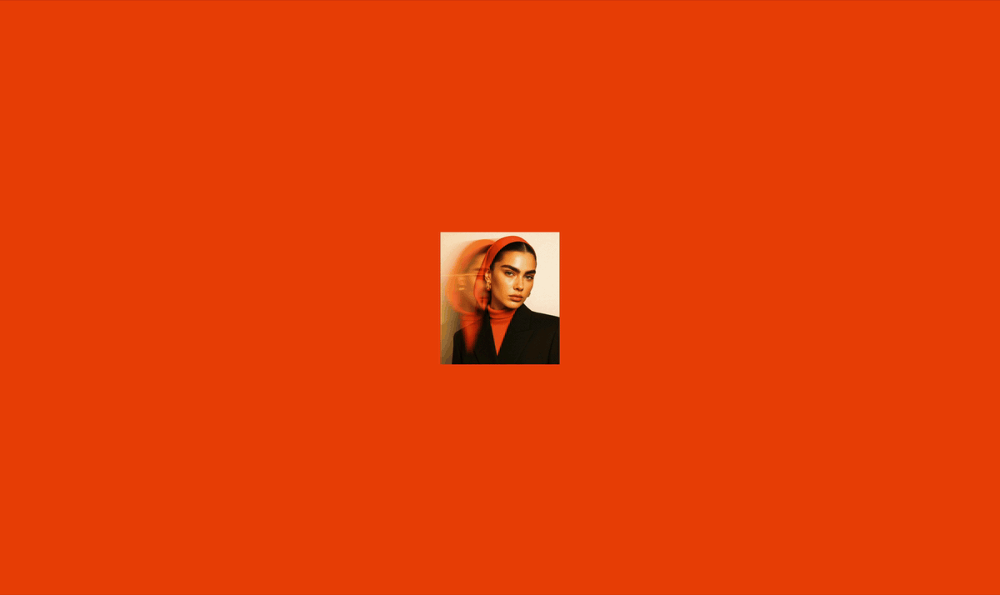

# Aeterna — Brand Experience Site



A preloader-driven hero experience powered by Next.js 15, Tailwind, and GSAP.

## ✨ Features

- **GSAP preloader** with mirrored hero slideshow alignment.
- **Responsive layout** with tuned breakpoints for mobile/desktop hero geometry.
- **Custom fonts & assets** wired via Tailwind CSS 4.
- **Open-source ready**: CC BY-NC 4.0 license, contribution guidelines, and documentation.

## 🚀 Getting Started

Install dependencies and run the development server:

```bash
npm install
npm run dev
# or yarn / pnpm / bun equivalents
```

Then visit [`http://localhost:3000`](http://localhost:3000).

## 🧰 Project Structure

- `components/Preloader.tsx` — GSAP timeline, side slides, and hero alignment.
- `components/Hero.tsx` — hero layout, slideshow, and post-preloader fade-in.
- `public/hero_img` — main hero asset.
- `public/slideshow` — supporting slides and favicon.

## 🤝 Contributing

1. Fork the repository.
2. Create a feature branch (`git checkout -b feature/your-idea`).
3. Commit with clear messages.
4. Open a PR describing the changes and testing steps.

Please lint before submitting:

```bash
npm run lint
```

## 📄 License

Released under the [Creative Commons Attribution–NonCommercial 4.0 License](./LICENSE). Remix it for personal or non-commercial work with attribution; commercial use is not permitted.

## 📸 Assets

- Favicon/icon: `public/slideshow/4.webp`
- Hero background: `public/hero_img/Aeterna_hero_img.webp`
- Slideshow: `public/slideshow/1.webp` – `public/slideshow/9.webp`
- Brand wordmark (logo): **Aeterna**

> Want to show it off? Record a short screen capture of the preloader + hero sequence and drop a GIF in this README.
